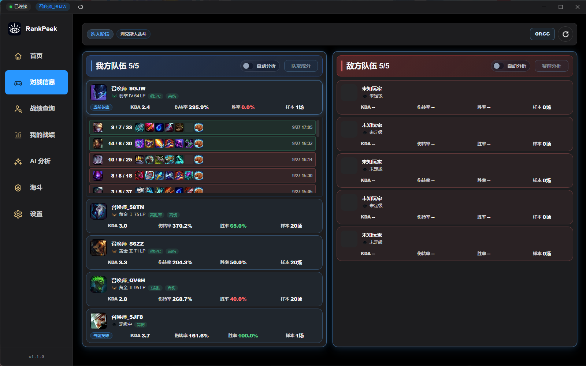
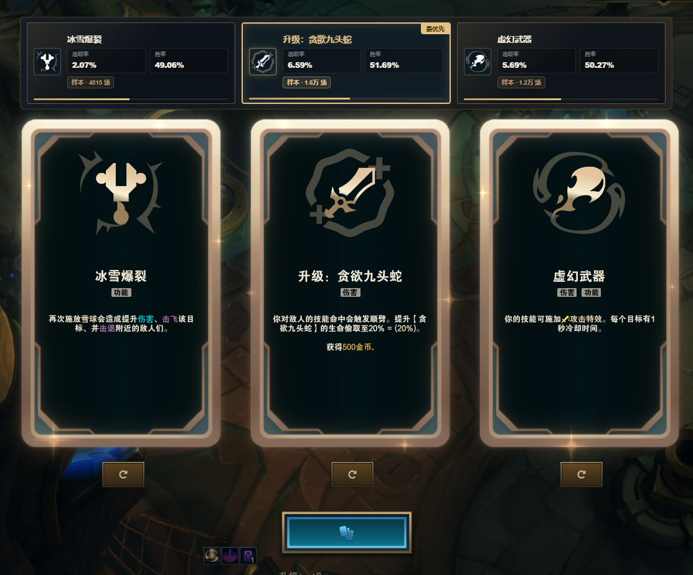

# RankPeek

英雄联盟对局助手（Windows 桌面版）。

**赛前看队友，海斗选强化。**


官网与下载：<https://rankpeek.cn> · [GitHub Releases](https://github.com/wxl11071123/rankpeek/releases)





## 它能做什么

### 排位 · 选人阶段先看清队友

打开选人界面，我方五个人的近期表现直接铺开：KDA、伤转率、胜率、样本场次，以及最近几局的战绩。
不用等打完一把才知道谁在炸鱼、谁在补位。

### 海斗 · 三选一不用猜

海克斯大乱斗的强化一出现，浮窗就把**你当前英雄**对应的胜率与选取率放在牌面上方。
173 个英雄、两万多组「英雄 × 强化」组合，梯度按 **胜率 60% + 选取率 40%** 的组内百分位自算。
另有强化榜与英雄榜，可以提前做功课。

### 战绩查询

输入昵称就能拉完整战绩：逐局的 KDA、参团率、伤害，以及多排标记和常玩英雄。

### AI 分析（可选）

赛前分析、赛后复盘、电子教练、夸夸机。**用你自己的、兼容 OpenAI 接口的 API Key** ——
请求直接发给你选的服务商，费用由服务商收取，RankPeek 不参与也不收费。
不填 Key 也不影响其他功能。

### 本地优先

战绩、设置、AI 报告都存在你自己的电脑上（`%LOCALAPPDATA%\RankPeek`）。卸载即删除。

## 它不做什么

- **不注入游戏进程**，不读内存，不修改游戏文件
- **不用注册、不用登录**，没有账号体系
- **没有广告、没有付费墙**，全部功能免费
- **不上传玩家身份信息** —— 昵称、账号、聊天记录一律不碰

## 隐私是怎么保证的

这个仓库存在的主要目的，就是让「客户端到底发了什么」可以被**核对**，而不是只能听我们说。

### 数据怎么流动

```
   英雄联盟客户端
        │  只读
        ▼
   LCU / SGP 本地接口
        │
        ▼
   rankpeek-backend（在你电脑上）
   Spring Boot · 127.0.0.1:8080
        │
        │  只有你主动点过「同意贡献」才走这条线
        ▼
   自建服务器（可选，默认关闭）
   只接收：英雄 / 强化 / 胜负
        └─ 不含账号、昵称、聊天
```

### 每条声明都能核对

| 声明 | 去哪看 |
| --- | --- |
| 上传默认关闭 | `rankpeek-frontend/src/renderer/views/HextechView.vue` |
| 客户端到底发了什么 | `rankpeek-backend/src/main/java/io/rankpeek/hextech/HextechContributionService.java` |
| 字段白名单 / 绝不上传清单 | `rankpeek-server/service/hextech_ingest.py` |
| 不存明细，只落匿名计数 | 同上（收到即并计数，不保留逐局记录） |
| 本机编号只存哈希 | 同上（`sha256(installId + 服务端盐)`） |
| 去重键跨客户端一致 | `rankpeek-backend/src/test/java/io/rankpeek/hextech/HextechContributionGameKeyTest.java` |

完整的字段白名单、对局哈希算法、保留期为什么不能靠过期删除、怎么撤回，全部写在 **[PRIVACY.md](PRIVACY.md)**。

## 下载

- **官网**：<https://rankpeek.cn>
- **GitHub Releases**：见 [最新版本](https://github.com/wxl11071123/rankpeek/releases)

## 系统要求

- Windows 10 / 11（仅 Windows）
- 需要英雄联盟客户端正在运行
- 用浮窗时请把客户端设为「**无边框**」或「**窗口**」模式 —— 独占全屏会盖住浮窗

## 常见问题

**会被判定为外挂吗？**
不会。RankPeek 不注入进程、不读内存、不改游戏文件。浮窗是一个独立的置顶窗口，跟录屏软件用的是同一类能力。

**要收费吗？**
不要。全部功能免费，没有广告。服务器有成本，所以设置页放了个打赏入口，纯自愿。

**AI 功能要花钱吗？**
用你自己的 API Key，请求直接发给你选的服务商，费用由他们收取。不填 Key 也能用其他功能。

**美服 / 欧服能用吗？**
没有在海外客户端上测试过，期待反馈。注意：「胜率 / 样本」来自全球样本，而「选取率 / T 级」目前是国服数据，海外服看到的结果可能不准。

**为什么安装时 Windows 会警告？**
安装包没有代码签名证书，因此触发 SmartScreen。点「更多信息 → 仍要运行」即可。

**数据多久更新一次？**
海斗数据包默认 36 小时检查一次，也可以在设置页手动「检查更新」。

---

# 开发者指南

## 技术架构

```
┌────────────────────────────────────────────────────────┐
│  rankpeek-frontend    Electron 28 + Vue 3 + TypeScript │
│                       无边框窗口 · hash 路由            │
├────────────────────────────────────────────────────────┤
│  rankpeek-backend     Spring Boot 3.5 · Java 21        │
│                       本机 127.0.0.1:8080               │
│                       打包为 GraalVM 原生镜像（约 100 MB）│
├────────────────────────────────────────────────────────┤
│  rankpeek-cloudflare  Worker + D1 + R2                 │
│                       反馈 / 公告下发 / 下载分发         │
├────────────────────────────────────────────────────────┤
│  rankpeek-server      自建接收端（Python 标准库）        │
│                       白名单校验 / 限流 / 去重           │
└────────────────────────────────────────────────────────┘
```

## 核心组件

| 组件 | 技术栈 | 职责 |
| --- | --- | --- |
| `rankpeek-frontend` | Electron + Vue 3 + TypeScript | 桌面客户端（含主进程 OCR 与浮窗） |
| `rankpeek-backend` | Java 21 + Spring Boot 3.5 + GraalVM | 本地后端服务 |
| `rankpeek-cloudflare` | Cloudflare Workers + D1 + R2 | 反馈、公告、下载分发 |
| `rankpeek-server/service` | Python 3（仅标准库） | 匿名数据接收端 |

## 项目结构

```
rankpeek/
├── rankpeek-frontend/          # Electron + Vue 客户端
│   └── src/
│       ├── main/               # 主进程：窗口、LCU、OCR、浮窗
│       ├── preload/            # 预加载脚本
│       └── renderer/           # 渲染进程（Vue）
├── rankpeek-backend/           # 本地后端
│   └── src/main/java/io/rankpeek/
├── rankpeek-cloudflare/        # 边缘 API
├── rankpeek-server/
│   └── service/                # 数据接收端（聚合与部署未包含）
├── scripts/                    # 仓库守卫
└── build.bat                   # 一键打包
```

## 开发环境搭建

前置：Windows 10/11 · Node.js 18+ · Java 21（推荐 GraalVM）· Maven 3.9+ · 正在运行的英雄联盟客户端

```powershell
# 1. 启动本地后端（数据目录切到 %LOCALAPPDATA%\RankPeek-dev）
.\scripts\dev-backend.bat

# 2. 启动桌面端
cd rankpeek-frontend
npm install
npm run electron:dev
```

## 构建

```powershell
.\build.bat
```

依次执行：仓库守卫 → 构建 GraalVM 原生后端 → 打包 Electron 安装包。
产物在 `rankpeek-frontend/release/`。构建前请确认 `GRAALVM_HOME` 指向你的 GraalVM。

> **构建出来的版本不含上传目标地址。** 地址放在
> `rankpeek-backend/src/main/resources/endpoints.properties`（不入库，见 `.gitignore`）。
> 拿不到这个文件时，海斗的自建数据、数据包与上传会整块关闭，其余功能照常 ——
> 这是刻意的：避免任何人克隆一份就往我们的服务器传数据。

## 测试

```powershell
cd rankpeek-frontend
npm test              # 渲染进程 + 共享模块（775 个）
npm run test:main     # 主进程（28 个）
npm run check:sfc     # Vue SFC 编译自检
npm run check:secrets # 密钥闸门

cd ../rankpeek-backend
mvn test              # 471 个
```

`npm run test:db` 单独拆出来，是因为 `better-sqlite3` 是原生模块：应用通过 `postinstall`
为 Electron 的 ABI 构建，而 `node --test` 需要当前 Node 的 ABI。跑之前请先退出正在运行的应用。

## 仓库守卫

```powershell
node scripts/check-no-automation.mjs        # 防止游戏自动化功能回来
node scripts/check-no-cloud-server.mjs      # 防止旧云端依赖回来
node scripts/check-no-server-addresses.mjs  # 防止把服务器地址写进仓库
```

## 开源范围

**除了下面这三项，其余全部开源** —— 包括 RP 指数、AI 分析、OCR 与浮窗：

| 未包含 | 原因 |
| --- | --- |
| `rankpeek-server/scripts/` | 数据聚合与发布 —— 榜单具体怎么算出来的 |
| `rankpeek-server/deploy/` | 部署脚本 |
| `rankpeek-frontend/public/ocr-models/` | OCR 模型（约 20 MB，第三方转换产物，授权待确认） |

**这不影响「客户端有没有偷偷上传」的审查** —— 那只需要看客户端发什么、接收端收什么，两者都在这个仓库里。

### OCR 模型

`rankpeek-frontend/public/ocr-models/` 不在仓库里。首次使用屏幕识别时，客户端会自动把模型下载到本机缓存目录；也可以在构建前手动放回该目录，让它随包分发。

## 已知限制

- 仅 Windows
- LCU 相关功能需要客户端正在运行
- 部分数据依赖上游服务，可能不可用或有延迟
- 「选取率 / T 级」目前是国服数据
- 浮窗需要客户端处于「无边框 / 窗口」模式

## 许可

MIT，见 [LICENSE](LICENSE)。

本项目最初基于 [dspos/league-insight](https://github.com/dspos/league-insight)（MIT，作者 ekko）的框架起步；
后端、前端与数据链路此后已大部分重写。原项目的版权声明保留在 [LICENSE](LICENSE) 中。

RankPeek 是非官方工具，与 Riot Games 及腾讯无任何关联。
